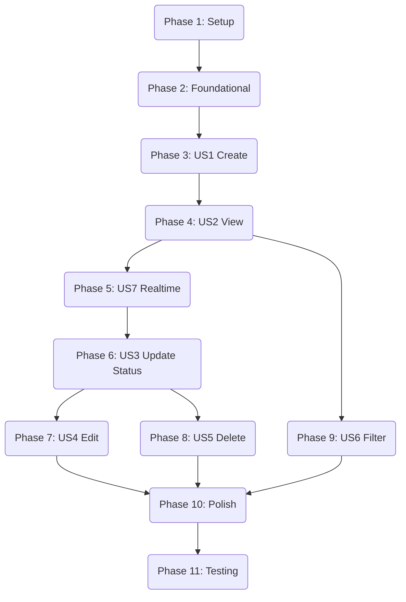

# 開發任務：高效待辦 (Productive To-do)

**功能**: `001-productive-todo-app`
**狀態**: 待辦
**優先級**: 高

本文件列出了開發「高效待辦」應用程式的所有必要任務。任務按階段組織，並標註了相關的使用者故事。

## 階段 1：專案設定 (Setup)

此階段建立專案基礎結構和開發環境。

- [x] T001 初始化 Angular 專案 (使用 Less, 無 Routing, 非 Standalone) 於專案根目錄
- [x] T002 安裝 NG-ZORRO UI 函式庫 (`ng add ng-zorro-antd`)
- [x] T003 安裝 Supabase 客戶端 (`npm install @supabase/supabase-js`)
- [x] T004 [P] 建立環境變數檔案 `src/environments/environment.ts` 與 `src/environments/environment.development.ts`
- [x] T005 [P] 建立核心模組 `src/app/core/core.module.ts` 與共享模組 `src/app/shared/shared.module.ts`

## 階段 2：基礎建設 (Foundational)

此階段建立核心服務和資料模型，為功能開發做準備。

- [x] T006 [P] 定義任務介面 `Task` 於 `src/app/core/models/task.model.ts`
- [x] T007 [P] 實作 `SupabaseService` 於 `src/app/core/services/supabase.service.ts`
- [x] T008 建立 `TaskService` 骨架於 `src/app/core/services/task.service.ts`
- [x] T009 建立 Todo 功能模組 `src/app/features/todo/todo.module.ts`

## 階段 3：使用者故事 1 - 建立新任務 (US1)

**目標**: 允許使用者輸入標題並建立新任務。
**獨立測試**: 輸入標題後按 Enter，新任務應被建立 (console log 或暫時顯示)。

- [x] T010 [US1] 建立 `TodoAddComponent` 於 `src/app/features/todo/components/todo-add/todo-add.component.ts`
- [x] T011 [US1] 實作 `addTask` 方法於 `src/app/core/services/task.service.ts`
- [x] T012 [US1] 將 `TodoAddComponent` 整合至 `src/app/app.component.html` (或主要 layout)

## 階段 4：使用者故事 2 - 檢視與排序任務列表 (US2)

**目標**: 顯示任務列表，按時間倒序排列，並處理空狀態。
**獨立測試**: 建立多個任務，確認顯示順序正確；清空列表確認顯示空狀態。

- [x] T013 [P] [US2] 建立 `TodoItemComponent` 於 `src/app/features/todo/components/todo-item/todo-item.component.ts`
- [x] T014 [US2] 建立 `TodoListComponent` 於 `src/app/features/todo/components/todo-list/todo-list.component.ts`
- [x] T015 [US2] 實作 `getTasks` 方法 (含排序邏輯) 於 `src/app/core/services/task.service.ts`
- [x] T016 [US2] 在 `src/app/features/todo/components/todo-list/todo-list.component.html` 中實作空狀態 (Empty State)

## 階段 5：使用者故事 7 - 資料持久性與即時同步 (US7)

**目標**: 確保資料在重新整理後保留，並透過 Supabase Realtime 同步。
**獨立測試**: 開啟兩個視窗，在一處新增任務，另一處應即時出現。

- [x] T017 [US7] 在 `src/app/core/services/task.service.ts` 中整合 Supabase Realtime 訂閱

## 階段 6：使用者故事 3 - 更新任務狀態 (US3)

**目標**: 透過核取方塊切換任務完成狀態。
**獨立測試**: 點擊核取方塊，狀態應更新且 UI 應反映變更。

- [x] T018 [US3] 在 `src/app/features/todo/components/todo-item/todo-item.component.html` 中新增核取方塊 UI
- [x] T019 [US3] 實作 `updateTaskStatus` 方法於 `src/app/core/services/task.service.ts`

## 階段 7：使用者故事 4 - 編輯任務詳情 (US4)

**目標**: 使用 Modal 編輯任務標題和描述。
**獨立測試**: 點擊任務開啟 Modal，修改後儲存，列表應更新。

- [x] T020 [US4] 實作編輯 Modal 邏輯於 `src/app/features/todo/components/todo-item/todo-item.component.ts` (或獨立 Modal 元件)
- [x] T021 [US4] 實作 `updateTask` 方法於 `src/app/core/services/task.service.ts`

## 階段 8：使用者故事 5 - 刪除任務 (US5)

**目標**: 刪除任務並顯示確認對話框。
**獨立測試**: 點擊刪除，確認後任務消失。

- [x] T022 [US5] 在 `src/app/features/todo/components/todo-item/todo-item.component.ts` 中實作刪除確認 Modal
- [x] T023 [US5] 實作 `deleteTask` 方法於 `src/app/core/services/task.service.ts`

## 階段 9：使用者故事 6 - 篩選任務 (US6)

**目標**: 篩選顯示全部、未完成或已完成的任務。
**獨立測試**: 切換篩選器，列表應只顯示符合條件的項目。

- [x] T024 [US6] 在 `src/app/features/todo/components/todo-list/todo-list.component.html` 中新增篩選控制項
- [x] T025 [US6] 實作篩選邏輯 (Pipe 或 Service) 於 `src/app/features/todo/todo.module.ts`

## 階段 10：修飾與跨切面關注點 (Polish)

- [x] T026 [P] 全域樣式調整與響應式設計優化 `src/styles.less`
- [x] T027 [P] 執行 Lighthouse 測試並優化無障礙性 (A11y)

## 階段 11：測試 (Testing)

- [x] T028 [Test] 設定 Playwright 測試環境
- [x] T029 [Test] 撰寫 US1 (建立) 與 US2 (檢視) 的 E2E 測試
- [x] T030 [Test] 撰寫 US3 (狀態) 與 US4 (編輯) 的 E2E 測試
- [x] T031 [Test] 撰寫 US5 (刪除) 與 US6 (篩選) 的 E2E 測試
- [x] T032 [Test] 撰寫 US7 (即時同步) 的多視窗 E2E 測試

## 相依性圖表 (Dependency Graph)

## 實作策略

1.  **MVP 優先**: 優先完成 US1, US2, US7, US3，這構成了一個最小可用的即時待辦清單。
2.  **元件驅動**: 利用 NG-ZORRO 元件加速 UI 開發。
3.  **服務抽象**: 所有 Supabase 邏輯封裝在 Service 中，保持元件乾淨。
